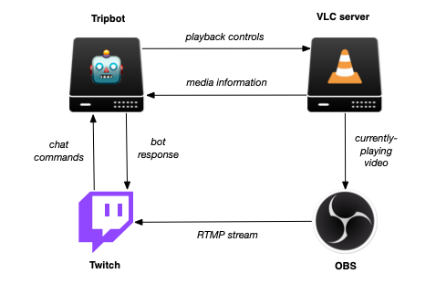

# Tripbot loves you :robot: :heart:

[](https://godoc.org/github.com/dmerrick/tripbot)
[](https://goreportcard.com/report/github.com/dmerrick/tripbot)
[](https://actions-badge.atrox.dev/dmerrick/tripbot/goto)
[](https://creativecommons.org/licenses/by-nc-sa/4.0/)

This is the source code to [whereisdana.today](http://whereisdana.today)

There are two main components, the chatbot itself, and a VLC server.

The general flow of information looks like this:



If you like the project, please consider subscribing to my channel.
Thanks for watching!

-Dana ([dana.lol](https://dana.lol))


## Running tripbot locally

You can use `docker-compose` to run tripbot on your own machine.
It is configured to spin up all of the dependencies for the project.
A helper script ([`bin/devenv`](https://github.com/dmerrick/tripbot/blob/master/bin/devenv)) has been created to make the process a little easier.
For example:

```bash
# (optional) create alias for devenv script
alias devenv="$(pwd)/bin/devenv"

# spin up tripbot stack on current machine
devenv up --daemon
# see running containers
devenv ps

# see logs for a specific container
devenv logs tripbot

# shut down everything
devenv down
```


## Other Useful Docs

### Infra

See [infra/README.md](infra/README.md) for infra setup instructions.

### Database

See [db/README.md](#) for database instructions.


