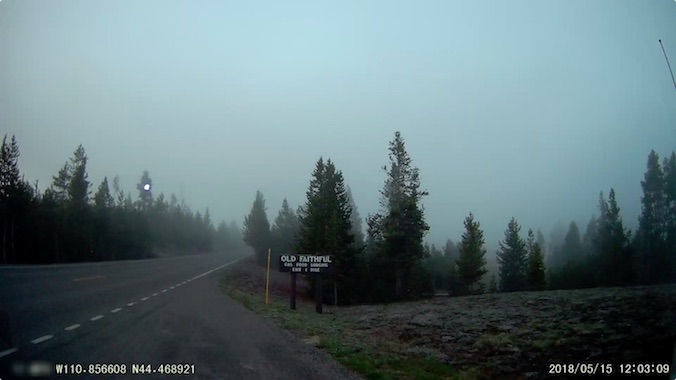

# A Dana Life... Live!



This is the source code to [whereisdana.today](http://whereisdana.today)

If you like it, please follow my channel. Thanks for watching!

-Dana

[dana.lol](https://dana.lol)

[](https://goreportcard.com/report/github.com/dmerrick/danalol-stream)

## Install

Go should auto-magically pull down all of the required packages when you use `go run` to run something.
You will also need to run:

```
# install tesseract
sudo apt install tesseract-ocr libtesseract-dev
```

To get Streamlabs chat to work on Linux, I ended up using the [obs-linuxbrowser](https://github.com/bazukas/obs-linuxbrowser) plugin for OBS.

### Database

See [db/README.md](#) for database instructions.


## Common Tasks

### Backup logs

```
mv log/bot.log log/bot.$(date "+%Y%m%d").log
```

### Start the bot

```
go run cmd/tripbot/tripbot.go
```


### Update a package

```
go get -u github.com/nicklaw5/helix
```

### See out-of-date packages
```
go get -u github.com/psampaz/go-mod-outdated
go list -u -m -json all | go-mod-outdated
```
