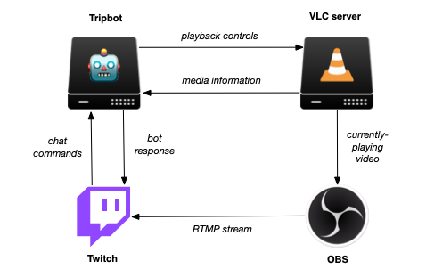

## Tripbot loves you :robot: :heart:

[](https://pkg.go.dev/github.com/adanalife/tripbot)
[](https://goreportcard.com/report/github.com/adanalife/tripbot)
[](https://github.com/marketplace/actions/super-linter)
[](https://github.com/adanalife/tripbot/releases)

[](https://tldrlegal.com/license/mit-license)

This is the source code to [whereisdana.today](http://whereisdana.today), a 24/7 interactive [slow-tv](https://en.wikipedia.org/wiki/Slow_television) art project streaming on Twitch and YouTube.

If you like it, please consider [subscribing](https://dana.lol/prime) to my channel on [Twitch.tv](https://www.twitch.tv/ADanaLife_).
Thanks for watching!

-Dana ([dana.lol](https://dana.lol))


### How it all works

There are three main components built from this repo, each running in its own container: the chatbot itself, which listens for user commands; a VLC-based video server, which manages the currently-playing video; and an overlay server for on-screen graphics. The scene compositing and streaming to the platforms (Twitch and YouTube) is handled by OBS, which lives in its own repo ([adanalife/obs](https://github.com/adanalife/obs)) and pulls the VLC output over RTSP — so the bot and video server can still be split across machines. The chatbot still controls that OBS over its WebSocket (start/stop, health watchdog). The admin UI lives in a separate private repo ([adanalife/tripbot-console](https://github.com/adanalife/tripbot-console)), and platform API calls route through a private [adanalife/platform-gateway](https://github.com/adanalife/platform-gateway) service.

The general flow of information looks like this:



For more detail, check out [Tripbot, the Adventure Robot](https://dana.lol/2020/04/15/tripbot-the-adventure-robot/).


### Developing on the host (quick start)

Day-to-day Go work happens directly on the host. You'll need:

- [mise](https://mise.jdx.dev) — provides the Go toolchain pinned in [`.tool-versions`](.tool-versions)
- [go-task](https://taskfile.dev) — the task runner (`task --list` shows everything)
- libvlc headers — needed by the cgo bindings behind the vlc/onscreens binaries: `brew install --cask vlc` on macOS, `apt install libvlc-dev` on Linux

```bash
# run the unit tests (natively on macOS; plain `task test` runs them in docker)
task test:macos

# or call go directly through mise
mise exec -- go test ./...
mise exec -- go build ./cmd/tripbot

# build the libvlc-linked binary on macOS (sets the cgo flags for VLC.app)
task vlc-server:build:macos
```

### Running the full stack locally

You can use `docker-compose` to run tripbot on your own machine.
It is configured to spin up all of the dependencies for the project.
A helper script ([`bin/devenv`](bin/devenv)) has been created to make the process a little easier.
For example:

```bash
# (optional) create alias for devenv script
alias devenv="$(pwd)/bin/devenv"

# spin up tripbot stack on current machine
devenv up --daemon
# see running containers
devenv ps

# see logs for a specific container
devenv logs tripbot

# shut down everything
devenv down
```

### Changelog

Changelog entries are managed with [towncrier](https://towncrier.readthedocs.io). **Every PR into `main` adds a fragment** describing its user-facing change — a `changelog` CI check enforces this (label a PR `skip-changelog` for dependabot bumps, CI-only tweaks, or pure refactors that warrant no entry).

A fragment is a small markdown file in [`changelog.d/`](changelog.d/) named `<PR-number>.<type>.md`, e.g. `889.fix.md`. Its contents are the entry prose (bold lead-in sentence, then detail — match the existing [`CHANGELOG.md`](CHANGELOG.md) style); the PR link is added automatically.

```bash
# scaffold one (opens $EDITOR); or just create the file by hand
task changelog:add PR=889 TYPE=fix

# preview the assembled notes
task changelog:preview
```

Types map to the changelog's component sections: `gateway`, `chatbot`, `onscreens`, `vlc`, `console`, `fix`, `deploy`, `ci`, `cleanup`, `misc`, plus `summary` (a lead paragraph for the release, named `+summary.summary.md` — no PR number).

### Releases

Releases are trunk-based: [release-please](https://github.com/googleapis/release-please) maintains a standing release PR on `main` with the next version, computed from the conventional commits since the last release. The release PR also carries the collated changelog (built from the `changelog.d/` fragments) and the bumped + re-synthed prod deploy manifests. **Merging the release PR is the release**: it tags `vX.Y.Z`, publishes the GitHub Release, kicks off the multi-arch image builds, and deploys prod (prod-1 autosyncs from `main`). The `vlc` pod restart briefly drops the playing video, so merge at a quiet moment.
